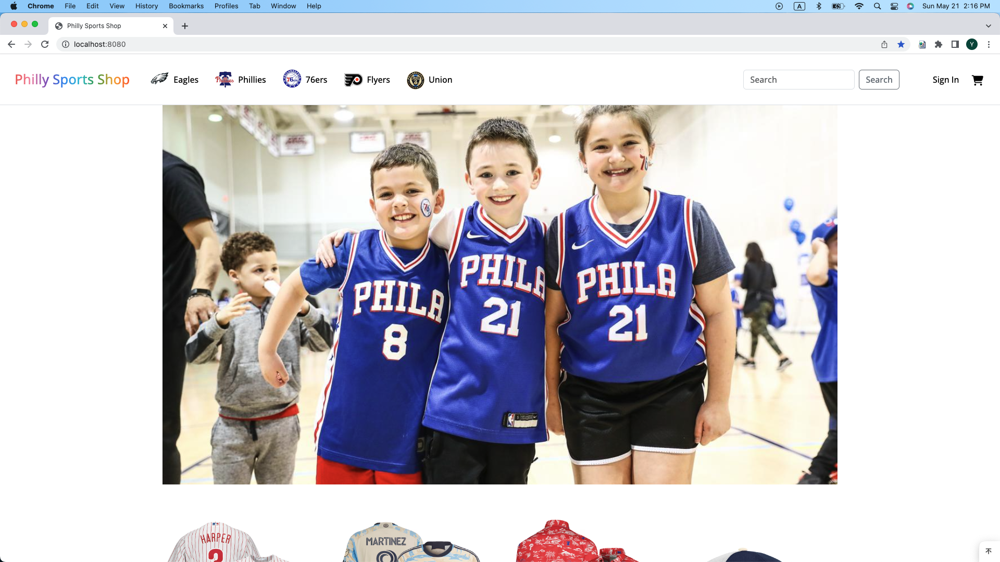
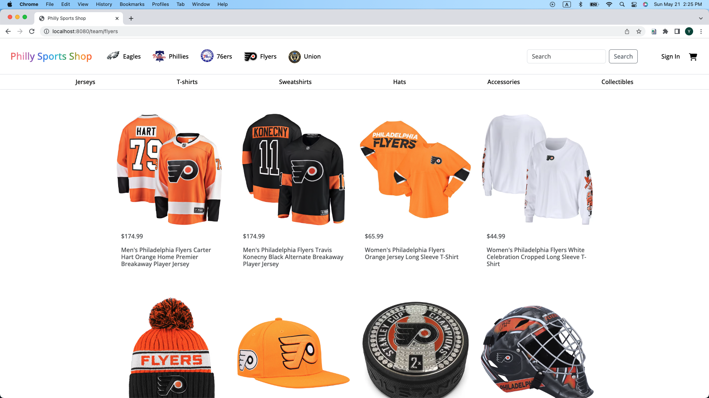
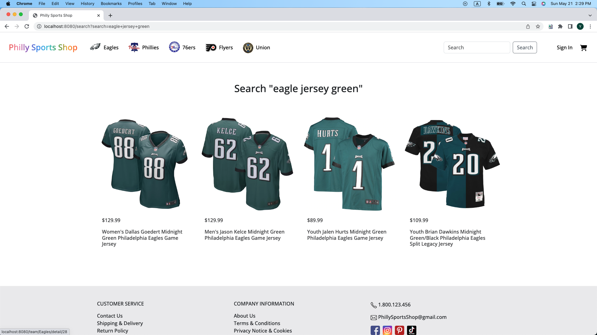
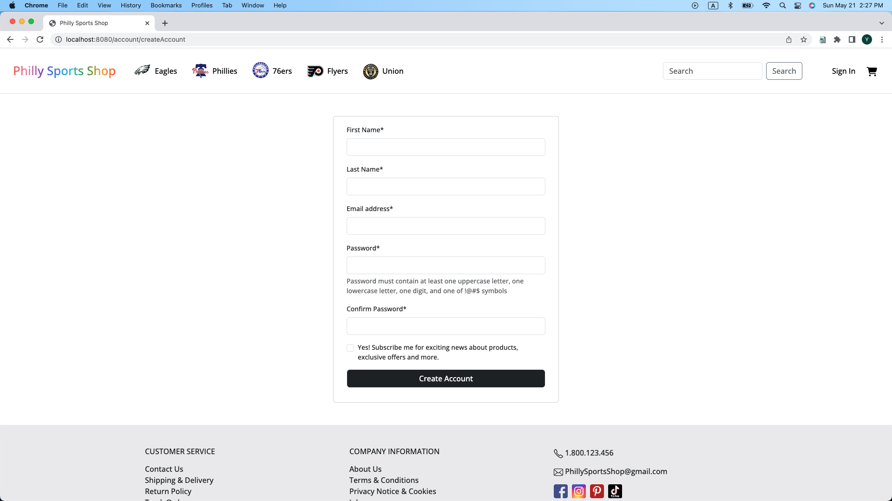
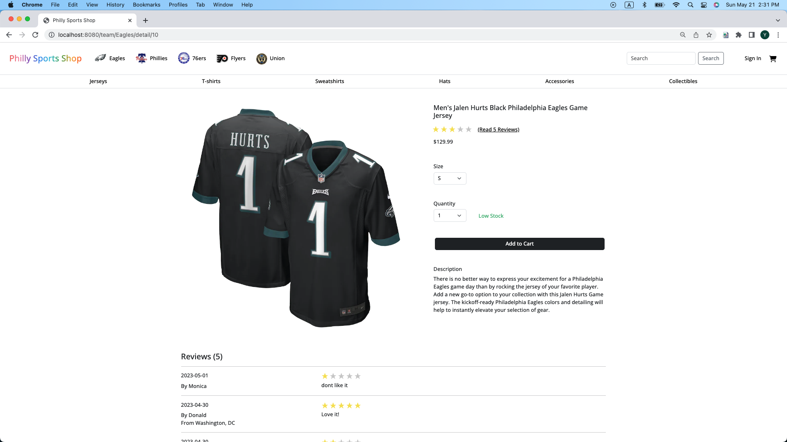
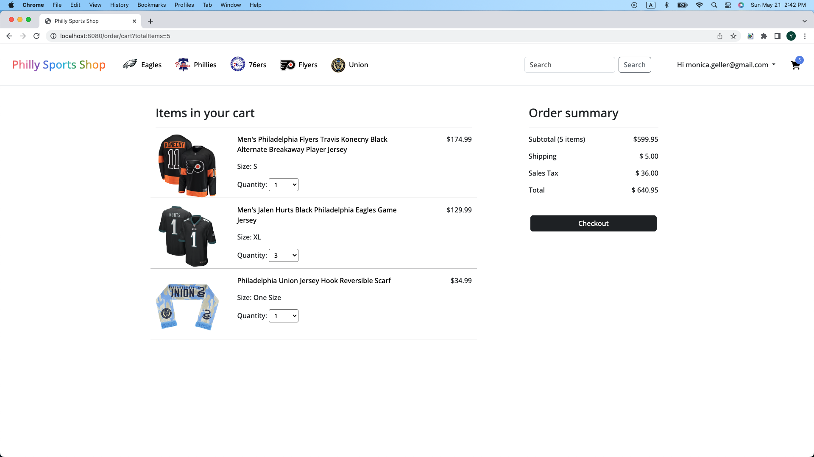
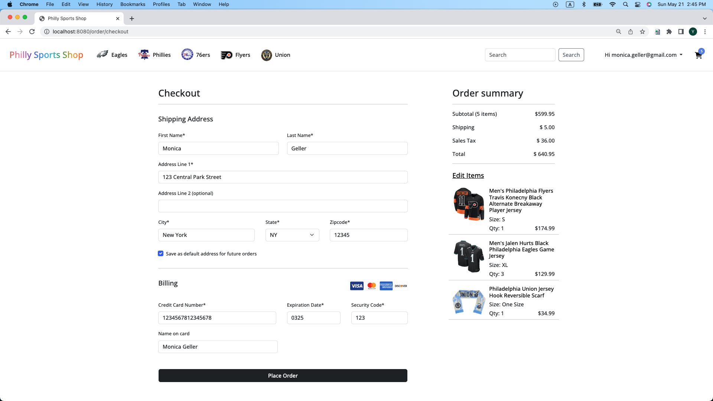

# Philly Sports Shop

## Overview

The objective of this project is to design and develop an online shopping website that sells sports gear for major sports teams in Philadelphia. 

Sports fans usually support several local sports teams, so this website will allow customers to purchase sports gear for different sports teams on one website. 

The website will feature a user-friendly interface that enables users to browse products based on teams, search for products, view product details, add products to their cart, and complete the checkout process.

## Tech stack

Front-end:

HTML - define the structure of the website

CSS - style the website's visual appearance

JavaScript - create interactive elements on the website

Back-end:

MySQL - the database to store the website's data

Java - the programming language to build the website's backend functionality, handle business logic, and interact with the database

Spring Boot - create web application, manage dependencies and configurations, and handle security, authentication, and authorization

## Features

### 1. Product Catalog 

The home page shows a carousel of fans wearing sports gear from differet teams, and then list some products. The products will be shuffled to show some other random product from database whenever the home page is loaded again. In the navbar, customers can select which sports team they would like to browse products. 

In each team page, customers can select the category of products they would like to browse.

Customers can also search for products using multiple keywords.

### 2. User Registration 

Customers will be able to register and create their accounts on the website. They will be required to provide basic information such as name and email address. The input data will be validated.

### 3. Product Detail Page

Each product will have a dedicated page that will display detailed information about the product, including product images, description, size, quantity, and customer reviews. Authenticated customers can add the product to shopping cart. The customers who have purchased this product can write reviews.

### 4. Shopping Cart: 

The shopping cart page will load the products left in the cart from the authenticated customers' prior browsing. The customers will be able to view the contents of their updated shopping cart, change the quantity and remove products if necessary. 

### 5. Checkout 

The page will load the shipping address that customers had saved in the account for easier checkout. Customers will be asked to fill out the payment information.

### 6. Other

Customers will be able to change email address and password, manage saved address, and also check order history.

